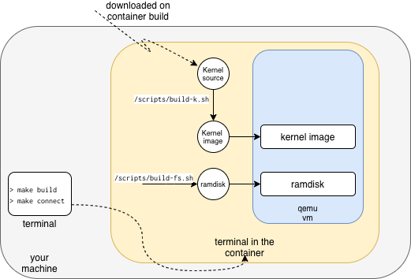

> A simply reproducible Linux kernel playground. It creates a sandbox container
> where you can checkout, compile and run the latest (stable) linux kernel with qemu.

  

## Instructions

- To build the container: `make build` (this also checks out and compiles the
  latest version of the Linux kernel)

- To open a terminal in the container: `make connect`

- In the container

  1. run `/scripts/build-fs.sh` to build up the initial ram disk
  2. run `/scripts/start-qemu.sh` to launch the kernel;
  3. To disconnect from qemu: CTRL-a x

If you modify the kernel code, rerun `/scripts/build-k.sh`. Currently there is
only the vi editor installed; to install other tools in the container use
`apt-get`.

## Challenges

- Challenge 1: try to build and run the kernel. You should see AOS-MINI-LINUX
  printed in the terminal of the container.

- Challenge 2: try to compile and install in the 'hello world' kernel the module
  in `/demos/modules`.

## References

- https://www.collabora.com/news-and-blog/blog/2017/01/16/setting-up-qemu-kvm-for-kernel-development/
- https://github.com/gurugio/book_linuxkernel_blockdrv/blob/master/environment.md
- https://github.com/cirosantilli/linux-kernel-module-cheat#u-boot
